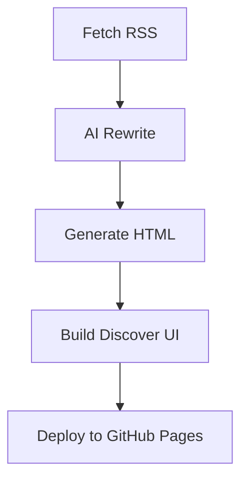

# 🌐 Auto News Publisher - Google Discover Style


🔍 **Sistem otomatis berita AI** dengan tampilan mirip Google Discover, mendukung:
- Multi-sumber RSS/API
- AI Rewrite (DeepSeek + OpenAI)
- Auto-publish ke GitHub Pages
- Optimasi SEO lengkap

## 🚀 Fitur Utama
| Fitur | Teknologi |
|-------|-----------|
| **Google Discover UI** | Responsive Card Layout • Material Icons • Dark Mode |
| **AI Content Engine** | DeepSeek API • OpenAI GPT-3.5 • Fallback System |
| **Automation** | GitHub Actions • Scheduled Updates • Auto-Deploy |
| **SEO Optimized** | Sitemap.xml • OG Tags • Semantic HTML |

## 🛠️ Struktur File Terbaru
```bash
.
├── berita/               # Artikel HTML (format terstruktur)
│   └── YYYY-MM-DD/       # Organisasi per tanggal
├── assets/               # Resource publik
│   ├── styles.css        # CSS terpusat
│   └── default-image.jpg # Fallback image
├── scripts/
│   ├── ai_rewriter.py    # Kecerdasan buatan
│   └── generate_*.py     # Generator konten
├── config.json           # Konfigurasi
└── index.html            # Tampilan utama

## ⚙️ Cara Setup
1. **Clone Repo**
   ```bash
   git clone https://github.com/kimgebin/berita-otomatis.git
   cd berita-otomatis
   ```

2. **Atur Secrets** (`Settings > Secrets > Actions`):
   - `DEEPSEEK_API_KEY`
   - `OPENAI_API_KEY` (opsional)

3. **Konfigurasi** (`config.json`):
   ```json
   {
     "rss_feeds": ["https://example.com/rss"],
     "ui": {
       "theme": "dark",
       "max_articles": 20
     }
   }
   ```

## 🔄 Alur Kerja


## 📄 File Penting
| File | Fungsi |
|------|--------|
| `sitemap.xml` | Auto-generate URL untuk SEO |
| `robots.txt` | Kontrol crawler search engine |
| `berita_rewrite.log` | Audit trail proses AI |

📌 **Note**: Sistem akan otomatis berjalan setiap jam via GitHub Actions!
```

### 2. 📜 **sitemap.xml** (Auto-Generator Script)
Add this to `generate_homepage.py`:
```python
def generate_sitemap(articles):
    """Generate dynamic sitemap.xml"""
    with open('sitemap.xml', 'w', encoding='utf-8') as f:
        f.write('<?xml version="1.0" encoding="UTF-8"?>\n')
        f.write('<urlset xmlns="http://www.sitemaps.org/schemas/sitemap/0.9">\n')
        
        # Main page
        f.write('  <url>\n    <loc>https://kimgebin.github.io/berita-otomatis/</loc>\n    <changefreq>hourly</changefreq>\n  </url>\n')
        
        # Articles
        for article in articles:
            f.write(f'  <url>\n    <loc>https://kimgebin.github.io/berita-otomatis/{article["url"]}</loc>\n')
            f.write(f'    <lastmod>{datetime.now().strftime("%Y-%m-%d")}</lastmod>\n  </url>\n')
        
        f.write('</urlset>')